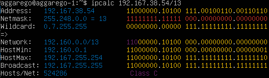
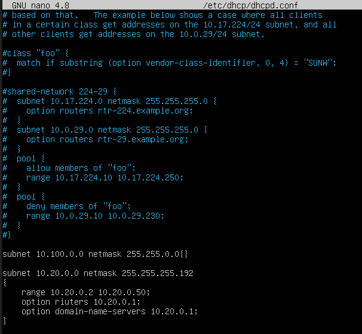
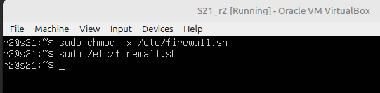
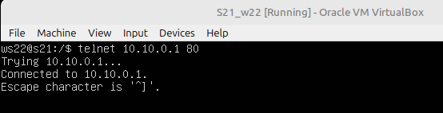

# REPORT

## Part 1. Инструмент ipcalc
* Установил ipcalc с помощью команды ```sudo apt install ipcalc```


1. Сети и маски 
    1. Определил адрес сети 192.167.38.54/13 командой ```ipcalc 192.167.38.54/13``` (Network: 192.160.0.0/13)

    

    2. Перевел маски 255.255.255.0 в префиксную и двоичную запись, /15 в обычную и двоичную, 11111111.11111111.11111111.11110000 в обычную и префиксную

    

    3. Определил минимальный и максимальный хост (отмечены как HostMin и HostMax) в сети 12.167.38.4 при масках: /8, 11111111.11111111.00000000.00000000, 255.255.254.0 и /4

    

    

2. localhost
    1. Определил, можно ли обратиться к приложению, работающему на localhost, со следующими IP: 194.34.23.100, 127.0.0.2, 127.1.0.1, 128.0.0.1

    

    

    Для обращения на localhost могут использоваться только адреса из 127.0.0.0/8. В выводе команды ```ipcalc``` для этих адресов должно присутствовать loopback. Т. е. подходят адреса 127.0.0.2 и 127.1.0.1.
3. Диапазоны и сегменты сетей
    1. С помощью ipcalc можно определить публичные и частные ip. Если вывод команды в последеней строке ```Hosts/Net``` содержит ```Private Internet```, то ip - частный.

        

    То есть адреса 10.0.0.45, 192.168.4.2, 172.20.250.4, 172.16.255.255, 10.10.10.10  являются частными.

    2. У сети 10.10.0.0/18 возможные адреса: 10.10.0.2, 10.10.10.10, 10.10.1.255 (Определяется по HostMin и HostMax).

        

## Part 2. Статическая маршрутизация между двумя машинами
1. Поднял 2 виртуальные машины ws1 и ws2.
2. С помощью команды ```ip a``` посмотрел существующие сетевые интерфейсы.

    

3. Задал следующие адреса и маски: ws1 — 192.168.100.10, маска /16, ws2 — 172.24.116.8, маска /12 с помощью ```sudo nano /etc/netplan/00-installer-config.yaml```. Затем перезапустил сервис сети командой ```sudo netplan apply``` и  проверил установленные адреса ```ip a```.

    

    

4. С помощью ```sudo ip r add``` добавил статические маршруты между машинами и пропинговал соединение между ними.

    

    

5. Перезапустил машины (Прежние маршруты не сохранены). Добавил статические маршруты с помощью```sudo nano /etc/netplan/00-installer-config.yaml```, хатем применил настройки ```sudo netplan apply``` и проверил соединение пингованием (0% packet loss).

    
    
## Part 3. Утилита iperf3
1.  8 Mbps = 1 MB/s,
    100 MB/s = 800000 Kbps,
    1 Gbps = 1000 Mbps,
2. Установил утилиту iperf3 на обе машины. С помощью нее измерил скорость соединения между ws1 и ws2.

    

3. На ws1 ввел команду ```iperf3 -s``` для приема входящего соединения, на ws2 - ```iperf -c 172.24.116.8``` для подключения к ws1. Результаты показали скорость 3,87 Гбит/с.
    
    

    

4. Аналогично для ws2 и ws1. В результате получил скорость 3,78 Гбит/с. 
    
    

    

## Part 4. Сетевой экран
1. iptables

    1. На ws1 и ws2 создал и отредактировал файл /etc/firewall.sh, где -А - добавление правила, -p - протокол, --dport - порт для трафика, -j - цель правила.
            
        

         
        
    2. Запустил файлы на машинах.

        

    3. Пропинговал машины. Так как правила выполняются сверху вниз, вторые правила в конфигах не сработают. Поэтому ws1 не будет отвечать на пинг-запросы (echo reply), а ws2 - будет. 

        

        

2. nmap
    1. Запустил команду nmap 192.168.100.10, видно, что хост машины запущен (Host is up).

        

## Part 5. Статическая маршрутизация сети
1. Настройка адресов машин
    1. Настроил конфигурации машин в etc/netplan/00-installer-config.yaml согласно сети на рисунке.

        

        

        

        

        

        

    2. Перезапустил сервис сети командой ```sudo netplan apply``` и проверил командой ```ip -4 a```, что адрес машины задан верно.

        

        

        

        

        

    3. Также пропинговал ws22 с ws21 и  r1 с ws11.
        
        

        

2. Включение переадресации IP-адресов
    1. Для включения переадресации IP выполни команду на роутерах:
        ```sysctl -w net.ipv4.ip_forward=1```, при этом после перезагрузки переадресация перестанет работать.

        

        

    2. Для постоянной переадресации в файле /etc/sysctl.conf раcкомментировал строку net.ipv4.ip_forward = 1.

        

        

3. Установка маршрута по умолчанию
    1. Настроил маршрут по умолчанию (шлюз) для рабочих станций. Для этого добавил default перед IP-роутера в файле конфигураций.

        
    
    2. Командой ```ip r``` вывел добавленные маршруты. 

        

        

        

    3. Пропинговал с ws11 роутер r2 и показал командой ```tcpdump -tn -i enp0s3``` на r2, что пинг доходит (ICMP echo request). Ответы обратно к ws11 не доходят, т.к. нет шлюза у r2 для ответа к ws11.

        

         

4. Добавление статических маршрутов

    1. Добавил в роутеры r1 и r2 статические маршруты в файле конфигураций.

        

         

    2. Командой ```ip route show``` проверил, что маршруты добавлены

        

         
    
    3. На ws11 запустил команды ```ip r list 10.10.0.0/18``` ```ip r list 0.0.0.0/0```.

        

        В Linux маршруты выбираются по принципу наибольшего совпадения (longest prefix match). Это означает, что если есть несколько подходящих маршрутов, выбирается более конкретизированный (как парвило с более длинной маской). Default route используется для адресов с неизвестных сетей.
    
5. Построение списка маршрутизаторов
    1. Запустил команду дампа ```tcpdump -tnv enp0s3```
    2. Командой ```traceroute 10.20.0.10``` построил список маршрутизаторов на пути от ws11 до ws21.

        

        

    ```traceroute``` использует TTL (Time To Live) в IP-пакетах, чтобы определить каждый промежуточный хоп (роутер) на пути к цели, отправляя каждый раз пакет с увеличивающимся TTL (0, 1, ...).
    Cхема работы traceroute:
        ws11 (10.10.0.2)  
        [TTL=1] r1 (10.10.0.1)   
        [TTL=2] r2 (10.100.0.12)    
        [TTL=3] 10.20.0.10 (финальный ответ)
6. Использование протокола ICMP при маршрутизации
    1. Запустил на r1 перехват трафиика ```tcpdump -n -i eth0 icmp```
    2. Пропинговал с ws11 10.30.0.111 (несуществующий)
         
        

        

    Пинг не проходит, потому что r1 не знает маршрута до 10.30.0.0. r1 возвращает ICMP Destination Net Unreachable, так как не может доставить пакет.

## Part 6. Динамическая настройка IP с помощью DHCP
1. На r2 настроил в файле /etc/dhcp/dhcpd.conf конфигурацию службы DHCP.

    

2. В файле resolv.conf записал nameserver 8.8.8.8.

    

3. Перезагрузил службу DHCP командой ```systemctl restart isc-dhcp-server```.

    

    На машинах ws21 и ws22 закомментировал статический ip адрес для автоматического получения.
    
    

       

    Перезагрузил при помощи ```reboot``` и через ```ip a``` увидел, что они получили адрес.

      

    

    Также пропинговал ws22 с ws21.

    

4. Указал MAC-адрес у ws11, для этого в ```/netplan/00-installer-config.yaml``` добавил строки: ```macaddress: 10:10:10:10:10:BA``` и ```dhcp4: true```, также закомментировал строку со статическим адресом.

    

5. Для r1 настроил конфиги /etc/dhcp/dhcpd.conf и resolv.conf аналогично r2, но с жесткой привязкой к MAC-адресу (ws11). 

    

    

6. Провел аналогичные тесты (Перезагрузил dhcp и ws11, ```ip a```, ping ws11 c ws21).

    

    

    

7. Проверил адрес через ```ip a```, затем для удаления существующего адреса использовал ```sudo dhclient -r enp0s3```, запросил новый адрес ```sudo dhclient enp0s3``` и проверил обновленный адрес.

    

    В данном пункте использовались следующие опции dhcp сервера: динамический ip адрес с маской подсети(10.20.0.3/26), выданный из заданного диапазона, адрес шлюза (10.20.0.1), время аренды адреса (592 sec).

## Part 7. NAT
1. В файле ```/etc/apache2/ports.conf``` на ws22 и r1 изменил строку ```Listen 80```на ```Listen 0.0.0.0:80```, то есть сделал сервер Apache2 общедоступным.

    

2. На обеих машинах запустил веб-сервер Apache командой ```service apache2 start```.

    

3. Удаление правил в таблице filter — ```iptables -F```, удаление правил в таблице «NAT» — ```iptables -F -t nat```, отбрасывать все маршрутизируемые пакеты — ```iptables --policy FORWARD DROP```. -X - для удаления настроек, созданных вручную. 

    

4. Запустил firewall.sh и проверил соединение ws22-r1 командой ping (ws22 c r1 не пинговалась)

    

    

5. Добавил разрешение маршрутизации всех пакетов протокола ICMP правилом ```iptables -A FORWARD -p icmp -j ACCEPT```. Запустил firewall.sh и проверил соединение (машины пингуются).

    

    

6. Включил SNAT, а именно маскирование всех локальных IP из локальной сети, находящейся за r2 (сеть 10.20.0.0). Также Включил DNAT на 8080 порт машины r2 и добавил к веб-серверу Apache, запущенному на ws22, доступ извне сети. Запустил firewall.sh

    

    

7. Перед тестированием отключил сетевой интерфейс NAT. Проверил соединение по TCP для SNAT: для этого с ws22 подключился к серверу Apache на r1 командой: ```telnet 10.10.0.1 80```, где 1 - адрес r1, 2 - порт.

    

    ws22 отправляет пакет на 10.10.0.1. Пакет попадает на r2, который применяет SNAT: исходный IP подменяется на 10.100.0.12 (внешний IP r2), r1 видит запрос от 10.100.0.12 и отправляет ответ обратно на r2, который уже возвращается на ws22.

8. Проверил соединение по TCP для DNAT: для этого с r1 подключиться к серверу Apache на ws22 командой ```telnet 10.100.0.12 8080```.
    

    r1 отправляет запрос на 10.100.0.12 (r2), целевой ip на r2 меняется на ip ws22 и перенаправляется. На обратном пути r2 меняет обратный адрес на свой. Т.е. сервер ws22 крыт для внешних клиентов.

## Part 8. Дополнительно. **SSH Tunnels**
1. Запустил на r2 фаервол с правилами из Части 7. Запустил веб-сервер **Apache** на ws22 только на localhost (то есть в файле */etc/apache2/ports.conf* изменил строку `Listen 80` на `Listen localhost:80`).

    

    

2. Воспользовался *Local TCP forwarding* с ws21 до ws22, чтобы получить доступ к веб-серверу на ws22 с ws21 командой `ssh -L 8080:localhost:80 10.20.0.48`, где -L - локальный проброс порта, 8080 - порт с запускаемой машины, localhost:80 - целевой адрес и порт, 10.20.0.48 - ip адрес сервера, к которому подключаемся. Получаем доступ к серверу ws22 c ws21.

    

    Для проверки, сработало ли подключение, перешел во второй терминал (Alt + F2) и выполнил команду: `telnet 127.0.0.1 8080`

    

    С помощью `ps aux | grep sshd` и `kill -9 PID` закрываем подключение к серверу

    

3. Воспользовался *Remote TCP forwarding* c ws11 до ws22, чтобы получить доступ к веб-серверу на ws22 с ws11. Так как в firewall установлено правило `iptables --policy FORWARD DROP`- oтбрасывать все маршрутизируемые пакеты, используем двойное туннелирование: 1)  на r2 выполянем локальный проброс `ssh -L 9000:localhost:80 ws22@10.20.0.19`, 9000 - порт на r2, 10.20.0.19 - адрес ws22 и 2) c ws11 выполянем удаленный (remote) проброс до r2: `ssh -R 8080:localhost:9000 ws22@10.20.0.19`. Получаем доступ к серверу ws22 на ws11.

    

    

    Для проверки аналогично выполнил ```telnet 127.0.0.1 80```

    
